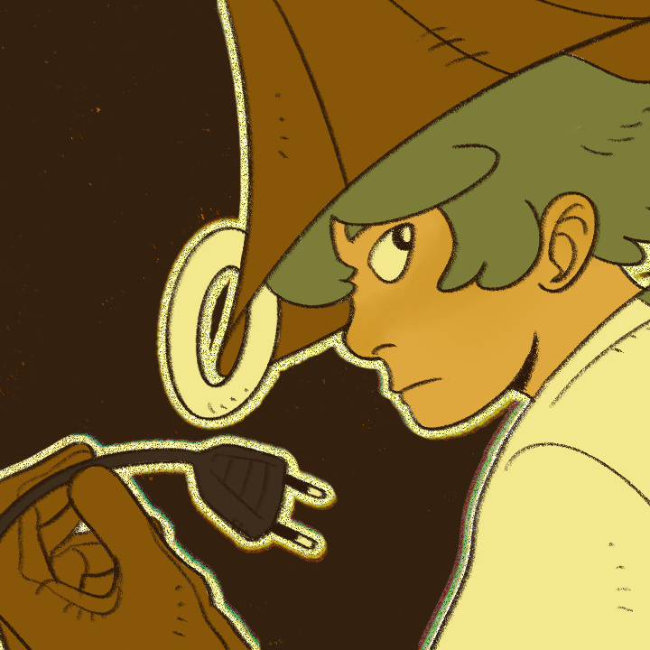
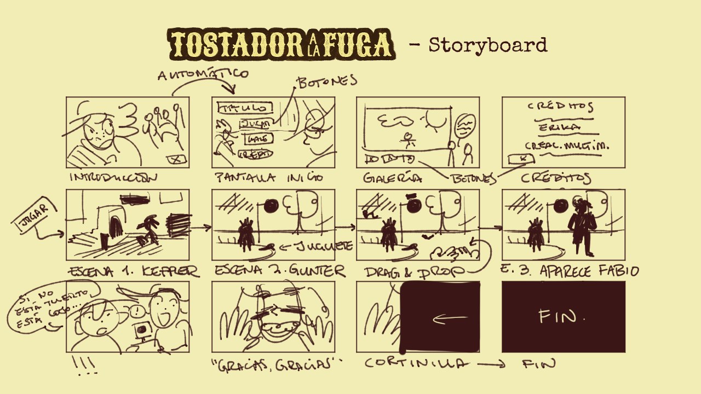
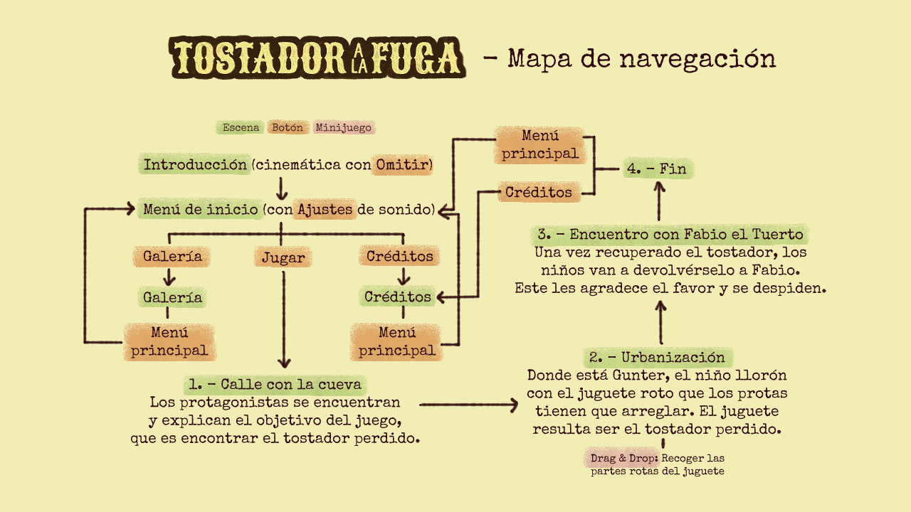
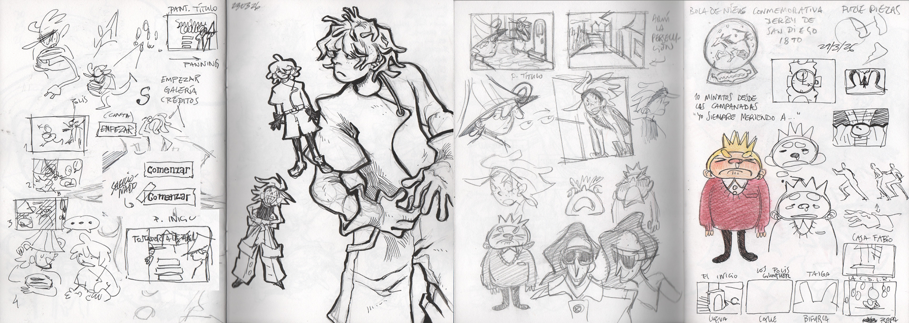
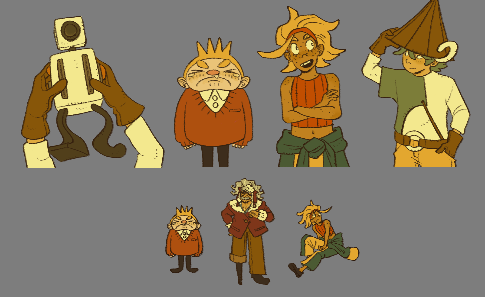
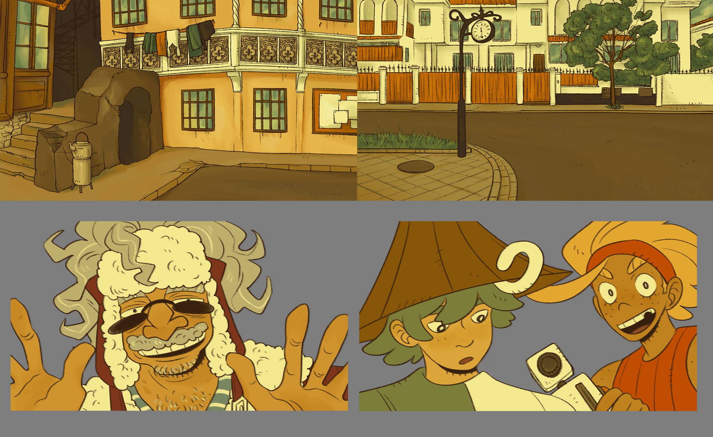
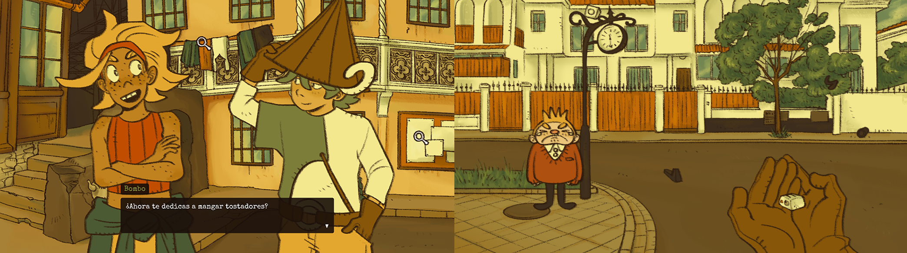

# _TOSTADOR A LA FUGA_

Proyecto de Creación Multimedia Interactiva de la Facultad de Bellas Artes, Universidad de Granada.

## 1.- Datos 

**- Título:** _TOSTADOR A LA FUGA_

**- Web:** https://escalerilla.github.io/tostadoralafuga/

**- Autor:** Erika García Moreno

**- Descripción y resumen:** El viejo Fabio el Tuerto ha perdido su querido tostador, pero en vez e buscarlo por su cuenta le ha dejado el marrón a un par de críos... y uno de ellos eres tú. Tan solo tienes que dar con el cachivache; no puede ser muy difícil, ¿verdad?

_TOSTADOR A LA FUGA_ es una pequeña aventura gráfica point-and-click en la que un par de amigos buscan un tostador. Mientras recorren las calles de la ciudad se toparán con residentes un poco peculiares, que les ayudarán a llegar a su objetivo. El diálogo y la investigación son lo más importante, pues el jugador ha de encontrar la forma de dar con el ansiado trasto prestando atención a lo que descubren nuestros protagonistas mientras interactúan con el mundo.

**- Estilo/género:**  Aventura gráfica, point-and-click

**- Logotipo:**

**- Resolución:** 1280x720px, tamaño fijo

**- Probado en:** Google Chrome y Mozilla Firefox

**- Tamaño proyecto:** 54.2MB

**- Licencia:** Este proyecto tiene una Licencia CC Reconocimiento-NoComercial-SinDerivados 4.0 Internacional (CC BY-NC-ND 4.0.)

**- Fecha:** Mayo de 2026

**- Medios:**
- Github: https://escalerilla.github.io/tostadoralafuga/
- Itch.io: https://escalerilla.itch.io/tostador-a-la-fuga

## 2.- Memoria del proyecto

### 2.1.- Storyboard: 
En _TOSTADOR A LA FUGA_ debes recorrer las calles de una ciudad en busca de un tostador perdido. Una parte fundamental a la hora de comenzar con un proyecto de este tipo es hacer un storyboard, donde aparecerán en orden secuencial (como es el caso de este videojuego, ya que es una historia lineal) las escenas y un boceto general de cómo serán los planos y/o los personajes y objetos que aparecen en ellas. El storyboard es una referencia inmensamente útil durante todo el proyecto, ya que aunque se pueda ir editando nos ayuda a tener claro qué escenas no pueden faltar en el juego.

El juego comienza con una cinemática de una de nuestos protagonistas, Keppler, siendo perseguida por la policía. Una vez finalizada, entramos en el menú principal, donde el jugador puede decidir si:
- Jugar: Comenzar el juego. Los controles son muy sencillos; tan solo te hará falta hacer uso del ratón. Es hora de que el jugador se ponga en la piel del segundo protagonista, Bombo, y averigue el paradero del tostador que le han encomendado buscar. Al igual que en las novelas gráficas clásicas, el jugador tiene completa libertad para interactuar con los objetos de los escenarios, que le iran descubriendo información sobre el mundo que le rodea. Eso sí, para poder avanzar el jugador deberá hablar con ciertos personajes y ayudarlos.
De esta forma, Bombo se encontrará primero con su amiga Keppler, y ambos saldrán a buscar la tostadora. Interrumpidos por un niño que no para de llorar, deberán ayudarlo a arreglar su juguete roto (el minijuego Drag & Drop). El desenlace final del juego ocurre cuando descubren que el juguete recién arreglado del crío no es, ni más ni menos, que el tostador que buscaban desde un principio. Es entonces cuando aparece su verdadero dueño y agradece a nuestros protagonistas la ayuda, dando por finalizada la pequeña aventura. Una vez vista la cinemática final, el jugador puede volver directamente a la pantalla de créditos, por la que podrá acceder de nuevo al menú principal.
- Galería: Acceder a una galería que enseña diversas imágenes del juego.
- Créditos: Leer los créditos del juego.
- Ajustes de sonido: Ajustar el volumen tanto de la música como de los efectos de sonido, al igual que pausar la música o volver a reproducirla.

### 2.2.- Esquema de navegación
Al igual que el storyboard, el esquema de navegación es otra referencia fundamental a la hora de desarollar un videojuego, sobre todo si es la primera vez que uno se enfrenta a un proyecto de esta envergadura. Conforme el juego crece y la historia se desarrolla, es normal que el número de escenas, conversaciones y pantallas por las que deba avanzar el jugador crezca. El esquema de navegación me ayudó a tener claro en todo momento qué escenas clave debía crear y con qué otras escenas estaban conectadas. También incluí el miniuego principal (un Drag & Drop) y qué botones aparecían en cada escena, ya que estos son principalmente los nexos entre los menús (sobre todo los del inicio, como el menú principal, la galería o los créditos) y me ayudaba a no confundirme.

## 3.- Metodología

Para crear _TOSTADOR A LA FUGA_, he hecho uso de una metodología de desarrollo de productos multimedia basado en una metodología de UX (User Experience).

### 3.1.- Etapa 1: Ideación de proyecto

**- Investigación de campo:**

**- Motivación de la propuesta:** Este proyecto es interesante porque explora la posibilidad de narrar una historia a través de un medio interactivo como es el videojuego. Como gran fan de las novelas visuales y las aventuras gráficas, me dispuse a hacer una novela gráfica propia en la que predominase el diálogo y el atractivo gráfico, dejando que el jugador entre de lleno en su mundo y conozca a sus personajes. El juego no puede avanzar sin la interacción del jugador, que es quien mueve realmente las fichas del tablero, pero lo que hará que este quiera seguir jugando será que la historia realmente le captive y le de curiosidad saber cómo continúa. Los personajes son divertidos, alocados y el diálogo es dinámico. También quise que la historia tuviese una premisa un tanto tonta, como es buscar un tostador. Esto me dejó rienda suelta para crear situaciones y diálogos más divertidos.

**- Publico/audiencia:** Orientado a un público juvenil, debido al carácter divertido y dinámico de los diálogos. También está enfocado a aquellas personas que disfruten de las novelas gráficas, los point-and-click y las novelas visuales, pues _TOSTADOR A LA FUGA_ es un videojuego protagonizado por el diálogo y las interacciones entre personajes. Aunque el jugador tenga un papel fundamental a la hora de tomar decisiones y avanzar con la trama, la dificultad de las mecánicas es muy baja con el objetivo de que el jugador pueda centrarse en la historia y las conversaciones.

### 3.2.- Etapa 2: Desarrollo y actividades realizadas

(qué soluciones has planteado y cómo se han resuelto: juego, galería de fotos, grabación de video, etc.)

- Juego. 
- Video 
- Instrucciones y ayuda al usuario 
- Menús y elementos de navegación (botones)
- etc.

### 3.3.- Etapa 3: Problemas identificados

(que consideras que no  funciona correctamente y por qué )

## 4.- Conclusiones 

(explica brevemente tu valoración, problemas que has detectado y que te gustaría hacer o mejorar en el futuro )

## 5.- Referencias 

**- Artículos y blogs:** 
- https://github.com/mgea/godot?tab=readme-ov-file
- https://docs.godotengine.org/es/4.x/getting_started/step_by_step/index.html
- https://www.laytonseries.com/es/
- https://strategywiki.org/wiki/Category:Professor_Layton_and_the_Curious_Village_images
- https://www.ace-attorney.com/

**- Recursos y materiales audiovisuales:**
- Música:  Todo el soundtrack es de _The Great Ace Attorney Chronicles_, compuesto por Yasumasa Kitagawa.
- Ilustraciones, diseño de personajes, diseño de escenarios y dirección artística:  Erika García Moreno (todas las ilustraciones son propias y originales).
- Vídeo: _horizontally spinning rat_, de [swizzdizzy en YouTube](https://www.youtube.com/watch?v=3X-iqFRGqbc).
- Tipografía: Special_Elite.

**- Herramientas utilizadas**
- Godot Engine 4.6
- ClipStudioPaint

(imagen de la licencia, copiar y pegar aquí la correcta)

Mayo de 2026.
