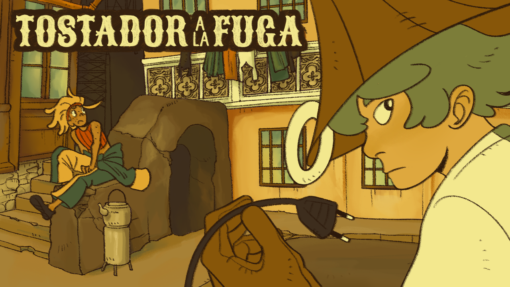

# _TOSTADOR A LA FUGA_

Proyecto de Creación Multimedia Interactiva de la Facultad de Bellas Artes, Universidad de Granada.

## 1.- Datos 

**- Título:** _TOSTADOR A LA FUGA_

**- Web:** https://escalerilla.github.io/tostadoralafuga/

**- Autor:** Erika García Moreno

**- Descripción y resumen:** El viejo Fabio el Tuerto ha perdido su querido tostador, pero en vez e buscarlo por su cuenta le ha dejado el marrón a un par de críos... y uno de ellos eres tú. Tan solo tienes que dar con el cachivache; no puede ser muy difícil, ¿verdad?

_TOSTADOR A LA FUGA_ es una pequeña aventura gráfica point-and-click en la que un par de amigos buscan un tostador. Mientras recorren las calles de la ciudad se toparán con residentes un poco peculiares, que les ayudarán a llegar a su objetivo. El diálogo y la investigación son lo más importante, pues el jugador ha de encontrar la forma de dar con el ansiado trasto prestando atención a lo que descubren nuestros protagonistas mientras interactúan con el mundo.

**- Estilo/género:**  Aventura gráfica, point-and-click

**- Logotipo:**

**- Resolución:** 1280x720px, tamaño fijo

**- Probado en:** Google Chrome y Mozilla Firefox

**- Tamaño proyecto:** 54.2MB

**- Licencia:** Este proyecto tiene una Licencia CC Reconocimiento-NoComercial-SinDerivados 4.0 Internacional (CC BY-NC-ND 4.0.)

**- Fecha:** Mayo de 2026

**- Medios:**
- Github: https://escalerilla.github.io/tostadoralafuga/
- Itch.io: https://escalerilla.itch.io/tostador-a-la-fuga (la contraseña es "tostador").

## 2.- Memoria del proyecto

### 2.1.- Storyboard: 
En _TOSTADOR A LA FUGA_ debes recorrer las calles de una ciudad en busca de un tostador perdido. Una parte fundamental a la hora de comenzar con un proyecto de este tipo es hacer un storyboard, donde aparecerán en orden secuencial (como es el caso de este videojuego, ya que es una historia lineal) las escenas y un boceto general de cómo serán los planos y/o los personajes y objetos que aparecen en ellas. El storyboard es una referencia inmensamente útil durante todo el proyecto, ya que aunque se pueda ir editando nos ayuda a tener claro qué escenas no pueden faltar en el juego.

El juego comienza con una cinemática de una de nuestos protagonistas, Keppler, siendo perseguida por la policía. Una vez finalizada, entramos en el menú principal, donde el jugador puede decidir si:
- Jugar: Comenzar el juego. Los controles son muy sencillos; tan solo te hará falta hacer uso del ratón. Es hora de que el jugador se ponga en la piel del segundo protagonista, Bombo, y averigue el paradero del tostador que le han encomendado buscar. Al igual que en las novelas gráficas clásicas, el jugador tiene completa libertad para interactuar con los objetos de los escenarios, que le iran descubriendo información sobre el mundo que le rodea. Eso sí, para poder avanzar el jugador deberá hablar con ciertos personajes y ayudarlos.
De esta forma, Bombo se encontrará primero con su amiga Keppler, y ambos saldrán a buscar la tostadora. Interrumpidos por un niño que no para de llorar, deberán ayudarlo a arreglar su juguete roto (el minijuego Drag & Drop). El desenlace final del juego ocurre cuando descubren que el juguete recién arreglado del crío no es, ni más ni menos, que el tostador que buscaban desde un principio. Es entonces cuando aparece su verdadero dueño y agradece a nuestros protagonistas la ayuda, dando por finalizada la pequeña aventura. Una vez vista la cinemática final, el jugador puede volver directamente a la pantalla de créditos, por la que podrá acceder de nuevo al menú principal.
- Galería: Acceder a una galería que enseña diversas imágenes del juego.
- Créditos: Leer los créditos del juego.
- Ajustes de sonido: Ajustar el volumen tanto de la música como de los efectos de sonido, al igual que pausar la música o volver a reproducirla.

### 2.2.- Esquema de navegación
Al igual que el storyboard, el esquema de navegación es otra referencia fundamental a la hora de desarollar un videojuego, sobre todo si es la primera vez que uno se enfrenta a un proyecto de esta envergadura. Conforme el juego crece y la historia se desarrolla, es normal que el número de escenas, conversaciones y pantallas por las que deba avanzar el jugador crezca. El esquema de navegación me ayudó a tener claro en todo momento qué escenas clave debía crear y con qué otras escenas estaban conectadas. También incluí el miniuego principal (un Drag & Drop) y qué botones aparecían en cada escena, ya que estos son principalmente los nexos entre los menús (sobre todo los del inicio, como el menú principal, la galería o los créditos) y me ayudaba a no confundirme.

## 3.- Metodología

Para crear _TOSTADOR A LA FUGA_, he hecho uso de una metodología de desarrollo de productos multimedia basado en una metodología de UX (User Experience).

### 3.1.- Etapa 1: Ideación de proyecto

**- Investigación de campo:**
La idea de este juego surgió a partir de dos personajes que tengo y que dibujo mucho, un par de niños que se conocen en una ciudad. Cuando se nos presentó la oportunidad de hacer un videojuego, supe que quería hacer uno donde estos dos personajes fueran los protagonistas de una aventura un poco disparatada y sin sentido, con el fin de explorar sus personalidades y cómo interactuarían con el mundo, que es la ciudad donde viven, llena de personajes extravagantes. Como tenía bastante claros los diseños de los dos protagonistas de antemano, el reto fue diseñar una ciudad y unos personajes que encajaran con ellos, y que hiciesen que la historia del juego fuese coherente, a la vez que divertida. Desde siempre me han encantado los juegos de puzles y las novelas gráficas, así que tenía claro que quería hacer alguna especie de point-and-click con una cámara fija donde el jugador pudiese investigar e interactuar con su alrededor. Tomé como inspiración principal la saga del Profesor Layton, de LEVEL-5, pues parte de premisas un tanto absurdas y tiene personajes muy carismáticos. Además, me sirvió como estudio de su estilo gráfico, que es uno de los aspectos que más me fascinan de la saga. La paleta de colores y la composición de los escenarios están inspiradas en estos juegos.

Estas son unas cuantas páginas de bocetos, ideas y exploraciones de los personajes, los puzles del juego y sus escenarios. Podemos ver a los protagonistas, prototipos de botones, animaciones, el esquema de navegación... y cómo nacieron personajes nuevos como el niño llorón, Gunter.

**- Motivación de la propuesta:** Este proyecto es interesante porque explora la posibilidad de narrar una historia a través de un medio interactivo como es el videojuego. Como gran fan de las novelas visuales y las aventuras gráficas, me dispuse a hacer una novela gráfica propia en la que predominase el diálogo y el atractivo gráfico, dejando que el jugador entre de lleno en su mundo y conozca a sus personajes. El juego no puede avanzar sin la interacción del jugador, que es quien mueve realmente las fichas del tablero, pero lo que hará que este quiera seguir jugando será que la historia realmente le captive y le de curiosidad saber cómo continúa. Los personajes son divertidos, alocados y el diálogo es dinámico. También quise que la historia tuviese una premisa un tanto tonta, como es buscar un tostador. Esto me dejó rienda suelta para crear situaciones y diálogos más divertidos.

**- Publico/audiencia:** Orientado a un público juvenil, debido al carácter divertido y dinámico de los diálogos. También está enfocado a aquellas personas que disfruten de las novelas gráficas, los point-and-click y las novelas visuales, pues _TOSTADOR A LA FUGA_ es un videojuego protagonizado por el diálogo y las interacciones entre personajes. Aunque el jugador tenga un papel fundamental a la hora de tomar decisiones y avanzar con la trama, la dificultad de las mecánicas es muy baja con el objetivo de que el jugador pueda centrarse en la historia y las conversaciones.

### 3.2.- Etapa 2: Desarrollo y actividades realizadas

- Diseño de personajes, diseño de escenarios y guión originales, con todos los assets (menos la música y el vídeo, cuyos créditos están más abajo) diseñados y dibujados por mí.
- Varios personajes con varias expresiones, es decir, diferentes sprites.
- Versión de sprites "mini" para aquellos personajes con los que se puede interactuar en el mundo (Keppler, Gunter y Fabio el Tuerto).
- Varios escenarios explorables conforme avanza la historia.
- Ilustraciones especiales para cinemáticas, animaciones y la pantalla de inicio.
- Guía visual para el jugador: Las lupas indican todos los elementos interactuables del mundo, y hacer click sobre ellos ejecutará un diálogo que ayudará al jugador a avanzar con la historia o a descubrir detalles sobre sus alrededores.
- Mecánicas complejas de juego: Implementación de Dialogic con diálogos normales y diálogos con elecciones, mediante las que el jugador deberá decidir si quiere avanzar con la historia o si, por el contrario, quiere seguir investigando por su cuenta. Para esto hice uso de señales y variables. Implementación, además, de un minijuego estilo Drag & Drop que el jugador debe superar para avanzar con la trama.
- Diseño de sonido: Soundtrack diverso controlado mediante sonido global y efectos de sonido para botones y Dialogic.
- Diseño de interfaz coherente en todo el juego: Botones, fuentes y un tema personalizado de Dialogic que se adecúen a la estética.
- Cinemáticas animadas mediante AnimationPlayer.

### 3.3.- Etapa 3: Problemas identificados

Primero he de mencionar que comencé en la asignatura con conocimientos muy básicos de programación y un conocimiento nulo sobre Godot. Aunque ha sido bastante complicado llevar a cabo un proyecto así en un solo semestre, lo que me ha ayudado a poder crear un videojuego con el que estuviese satisfecha es el hecho de que me entusiasman los videojuegos y las historias. Aunque no tenía ni idea de cómo usar Godot, me interesa el mundo del diseño de videojuegos y, al final, cuando uno juega mucho acaba aprendiendo qué funciona mejor y qué no. _TOSTADOR A LA FUGA_ ha acabado siendo un juego pequeño y corto pero cumple con el objetivo principal que me propuse: que fuese una historia divertida y un poco estúpida con un desenlace, una pequeña historieta donde es el jugador quien va abriéndose paso en el mundo. Mi mayor problema durante todo el desarrollo fue la longitud, pues al final un juego que se basa mucho en el diálogo tiende a extenderse y extenderse sin parar, sobre todo si narra una historia autoconclusiva. Al principio me emocioné y pensé en muchísimos puzles y caminos alternativos, pero al final opté por crear una línea de juego más sencilla y centrarme en que todo funcionase bien, pulir los temas de sonido, animación y controles y que el apartado gráfico fuese todo lo bueno que pudiese ser.
Por el camino me he tenido que dar cabezazos con un montón de fallos, código que se me quedaba colgado y cosas que sabía cómo quería que funcionasen pero no tenía ni idea de cómo programar. Al final conseguí que el juego funcione sin ningún problema muy grave.

## 4.- Conclusiones 

La verdad es que, por muy complicado que haya sido el proyecto, teniendo en cuenta además que lo hemos hecho en un solo semestre, ha sido probablemente el trabajo que más me ha motivado y que más he ido avanzando día a día. Siempre me había hecho mucha ilusión probar a hacer un videojuego, por pequeño que sea, aunque nunca me había atrevido por mi cuenta. Por eso me vino genial que esta asignatura me diera un poco un empujón para sacar un proyecto así adelante. Hay mil cosas que mejoraría de mi juego, pero me alegro de haber conseguido terminarlo (y acabar muy satisfecha con el resultado).

## 5.- Referencias 

**- Artículos y blogs:** 
- https://github.com/mgea/godot?tab=readme-ov-file
- https://docs.godotengine.org/es/4.x/getting_started/step_by_step/index.html
- https://www.laytonseries.com/es/
- https://strategywiki.org/wiki/Category:Professor_Layton_and_the_Curious_Village_images
- https://www.ace-attorney.com/

**- Recursos y materiales audiovisuales:**
- Música:  Todo el soundtrack es de _The Great Ace Attorney Chronicles_, compuesto por Yasumasa Kitagawa.
- Ilustraciones, diseño de personajes, diseño de escenarios y dirección artística:  Erika García Moreno (todas las ilustraciones son propias y originales).
- Vídeo: _horizontally spinning rat_, de [swizzdizzy en YouTube](https://www.youtube.com/watch?v=3X-iqFRGqbc).
- Tipografía: Special_Elite.

**- Herramientas utilizadas**
- Godot Engine 4.6
- ClipStudioPaint

Mayo de 2026.
